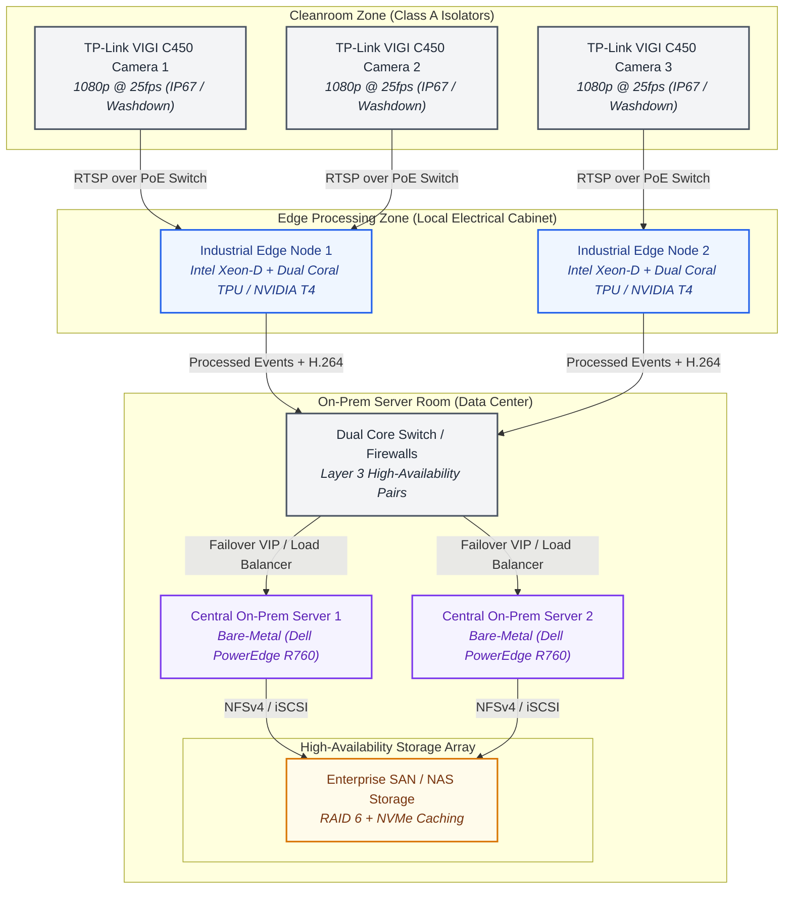

# Technical Architecture Document: AI-Powered Intervention Management System (On-Premise Deployment)

This document describes the enterprise-grade technical architecture for Dheera AI's **Intervention Management System** deployed in a GMP-regulated, air-gapped pharmaceutical cleanroom environment.

---

## 1. High-Level Infrastructure Topology

The system is deployed entirely on-premise to comply with strict pharmaceutical security protocols and to eliminate dependancies on external internet connectivity.

### 1.1 Physical Component Topology



### 1.2 Network Segmentation & VLAN Structure

To ensure complete isolation and zero interference with critical manufacturing operations, the network is split into three distinct, non-routable VLANs managed by a local Layer 3 core switch:

1.  **VLAN 100: Camera Control & Streaming Network (Unrouted)**
    *   **Scope**: Connects cleanroom IP cameras directly to the Edge Processing Nodes via dedicated PoE switches.
    *   **Security**: Non-routable to any other network. Cameras have static IP configurations. DHCP, DNS, and HTTP management interfaces are disabled on the cameras. 
2.  **VLAN 200: Processing & AI Inference Network**
    *   **Scope**: Connects Edge Processing Nodes to the Central On-Prem Servers.
    *   **Security**: Only permits outbound TCP/UDP traffic from Edge Nodes to Central Servers via specific API ports (e.g., port `5000` for REST, and secure RTSP/WebRTC streams). Direct access from external corporate users is blocked.
3.  **VLAN 300: Reporting & Dashboard Network (Corporate Zone)**
    *   **Scope**: Connects user web interfaces, QA managers, and internal API consumers to the Central Server.
    *   **Security**: Restricted behind local firewalls. Only routes standard HTTPS (port `443`) and WebSocket (port `443` or `8443`) traffic.

---

## 2. On-Premise Technology Stack

```
┌────────────────────────────────────────────────────────┐
│               Frontend: React 18 + TS                  │
├────────────────────────────────────────────────────────┤
│           Backend API: FastAPI + Uvicorn               │
├────────────────────────────────────────────────────────┤
│    Containerization & Orchestration: k3s (Kubernetes)  │
├────────────────────────────────────────────────────────┤
│    AI Serving Layer: ONNX Runtime (CPU / OpenVINO)     │
├────────────────────────────────────────────────────────┤
│          Video Protocols: RTSP + WebRTC                │
└────────────────────────────────────────────────────────┘
```

### 2.1 Containerization & Orchestration
*   **Recommendation**: **k3s (Lightweight Kubernetes)**
    *   **Rationale**: Unlike full enterprise Kubernetes (which is complex and resource-heavy for single-site edge clusters), k3s is packaged as a single binary, runs offline, and consumes minimal RAM (<512MB per node). This is ideal for local server cabinets.
    *   **High Availability**: Runs in a 3-node master control plane configuration to support active-active failover without any external cloud dependency.

### 2.2 Video Streaming Protocols
*   **Ingestion**: **RTSP (Real-Time Streaming Protocol)** over H.264. RTSP is the industrial standard supported directly by hardware cleanroom cameras (like the VIGI C450).
*   **Egress / Live View**: **WebRTC** (using a local media server like MediaMTX/go2rtc) to deliver sub-100ms latency video to operator web browsers, replacing laggy HTTP MJPEG streaming in production.

### 2.3 AI/ML Serving Layer
*   **Inference Engine**: **ONNX Runtime (with CPU / OpenVINO Execution Provider)**
    *   **Rationale**: Deploying PyTorch (`best.pt`) in production requires heavy CUDA dependencies and GPU overhead. Exporting models to ONNX (`best.onnx`) reduces runtime footprints. 
    *   Using the Intel OpenVINO Execution Provider allows our custom **YOLOv11n** model to run at sub-30ms latencies directly on local edge Xeon CPUs without requiring expensive NVIDIA GPUs.

---

## 3. Data Pipeline & Storage Architecture

### 3.1 Streaming Buffer & Clip Extraction Pipeline

```
              ┌──────────────────────────┐
              │  25 FPS RTSP Input Stream │
              └─────────────┬────────────┘
                            │
                            ▼
              ┌──────────────────────────┐
              │ In-Memory Ring Buffer    │
              │ (50-Frame Deque)         │
              └─────────────┬────────────┘
                            │
                            │ (If event triggers)
                            ▼
              ┌──────────────────────────┐
              │ Pre-Event Frames (50)    │
              │ + Active Event Frames    │
              └─────────────┬────────────┘
                            │
                            ▼
              ┌──────────────────────────┐
              │ FFmpeg Worker Thread     │
              │ (Writes to Disk)         │
              └──────────────────────────┘
```

1.  **In-Memory Ring Buffer**: Each camera feed has an isolated thread that writes raw frames to a rolling `collections.deque(maxlen=50)` array in system RAM. At 25 FPS, this acts as a dynamic **2-second pre-event buffer**.
2.  **Clip Extraction**:
    *   When the `EventClassifier` transitions from `IDLE` to `ACTIVE` (triggered by 5 consecutive frames of positive AI detections), a worker thread begins flushing the 50 pre-event frames plus all active incoming frames to a temporary memory-mapped file (`/dev/shm`).
    *   When the state returns to `IDLE` (following a 15-frame cooldown check), the file is closed.
3.  **FFmpeg Transcoding**: A background Python subprocess calls `ffmpeg` asynchronously to package the frames into a highly compressed, standard **H.264 MP4 file** saved straight to persistent storage.

### 3.2 Database & Storage Arrays
*   **Metadata & Event Logs**: **PostgreSQL (High Availability Multi-Master Cluster via Patroni)**
    *   Stores batch meta-data, intervention counts, event timestamps, and reference paths for visual snapshots.
*   **Object & Video Clip Storage**: **MinIO (On-Premise Object Storage Cluster)**
    *   MinIO simulates an S3-compatible API locally on the hardware SAN/NAS array. It handles raw snapshot JPEG files and video MP4 clips with built-in erasure coding to prevent file corruption.
*   **Backup & Disaster Recovery Strategy**:
    *   **Rsync / Replication**: Nightly automated sync of video archives from MinIO to an offline, physically disconnected secondary SAN array located in a separate building segment.
    *   **Database Dump**: PostgreSQL WAL (Write-Ahead Logging) archiving to local tape backup or cold storage servers.

---

## 4. Technical Data Flow

The step-by-step journey of a single video frame from the camera lens to the UI Dashboard:

```
[Camera Lens] 
  ──(H.264 compress)──> [RTSP Payload over Cat6] 
  ──> [OpenCV Frame Decoder] 
  ──> [Perceptual Hash Comparison (Stability Check)] 
  ──> [ONNX Runtime (YOLOv11n Detection)] 
  ──> [Event State Machine (Debounce & Trigger)] 
  ──> [PostgreSQL Log Writer] 
  ──> [FastAPI Websocket Broadcast] 
  ──> [Operator UI Dashboard]
```

| Step | Component | Action Description | Latency |
|:---|:---|:---|:---|
| **1** | Camera Lens | TP-Link VIGI captures cleanroom scene at 1080p, H.264-encodes the stream, and sends RTSP payloads over physical VLAN 100. | *0 ms* |
| **2** | Edge Node Ingestion | OpenCV running in the Edge Docker container decodes the RTSP stream back into a raw NumPy array in memory. | *+5 ms* |
| **3** | Stability Check | `CameraStabilityFilter` calculates perceptual hash (`pHash`) and compares to the previous frame to filter global camera vibration. | *+2 ms* |
| **4** | AI Inference | The decoded frame is resized to 640×640 and passed to the ONNX Runtime execution engine. YOLOv11n yields bounding boxes and confidence. | *+28 ms* |
| **5** | Event Classifier | Center point of hand bounding boxes matched to port boundaries. If active, frame idx is passed through the `IDLE -> ACTIVE` state machine. | *+1 ms* |
| **6** | Write to DB | When an intervention completes, the details are pushed to PostgreSQL via a connection pool and the video clip is moved to MinIO. | *+12 ms* |
| **7** | Real-time Broadcast | FastAPI grabs the event update and broadcasts a JSON payload via an active WebSocket connection (`/api/ws/events`). | *+2 ms* |
| **8** | Frontend Display | React UI receives the WebSocket message, updates the live intervention table, and flashes warning banners if limits are breached. | *+5 ms* |

*Total End-to-End Latency*: **~55 ms** (Ultra-responsive performance suitable for cleanroom control systems).

---

## 5. Security & Reliability (Infrastructure Level)

Operating inside a strict GMP pharmaceutical environment demands robust hardware resilience and data protection strategies.

### 5.1 Hardware Failover & Redundancy

*   **Edge Node Failover**: If an Edge Processing Node dies (e.g., hardware failure), the Layer 3 core switch senses the connection drop and routes the cleanroom camera's RTSP feed automatically to the secondary standby Edge Node within 3 seconds.
*   **Virtual IP (VIP) Cluster**: The central servers run behind a **Keepalived Virtual IP**. Operators and dashboards point to a single static IP address (e.g., `10.100.200.10`). If Server 1 crashes, Server 2 instantly assumes the VIP within 500ms, resulting in zero user downtime.
*   **Dual Power Supplies**: All servers and switch hubs are fitted with dual hot-swappable power inputs connected to independent UPS (Uninterruptible Power Supply) circuits.

### 5.2 Encryption and Hardening Standards

| Area | Protocol / Standard | Implementation |
|:---|:---|:---|
| **Data In-Transit** | **TLS v1.3** | All browser-to-server HTTP APIs, video streams (WebRTC), and database connections use local certificate authority (CA) signed SSL/TLS connections. |
| **Data At-Rest** | **AES-256 (LUKS/BitLocker)** | Physical server SSD/HDD volumes are encrypted at the operating system level using LUKS (Linux Unified Key Setup) with hardware security keys (TPM 2.0). |
| **Tamper-Evidence** | **SHA-256 Chained Hash** | The system's audit log (`audit_trail.jsonl`) chains entries cryptographically. If a database record is manually manipulated or deleted, the subsequent validation check fails instantly. |
| **Network Protection**| **IPS/IDS Snort Rules** | Local network firewalls monitor internal traffic for unauthorized port-scans or access requests outside the allowed VLAN architecture. |
