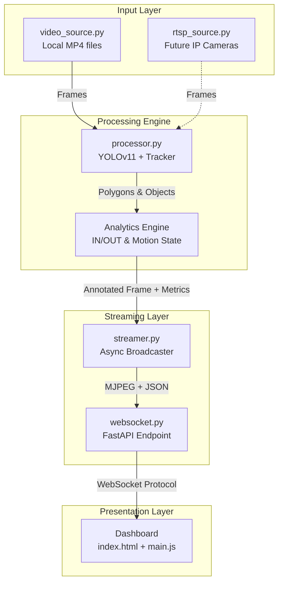

# Pharma Tracker Live Streaming Architecture

This document provides a comprehensive overview of the newly implemented live streaming architecture for the Pharma Tracker application. The architecture is designed to be modular, scalable, and future-proof, allowing seamless migration from local MP4 validation to live RTSP/WebRTC deployments.

---

## High-Level Architecture Diagram

---

## 1. Source Abstraction Layer (`app/sources/`)

The source layer decouples the video input from the processing logic. This allows the system to process data identically regardless of whether it originates from a pre-recorded validation video or a live camera.

*   **`video_source.py`**: Handles local MP4/AVI files. Crucially, it reads the original video's frames-per-second (FPS) and implements a pseudo-real-time simulator (`time.sleep(1/fps)`). This ensures that validation videos play at 1x speed, perfectly simulating a live camera feed for testing the dashboard.
*   **`rtsp_source.py`**: A structural placeholder designed to handle future RTSP streams from physical isolator cameras. It will eventually manage network reconnects and buffer minimization.

## 2. Processing Pipeline (`app/pipeline/processor.py`)

This is the core AI engine, refactored from `pipeline_v1.py` into a highly modular generator class (`PipelineProcessor`).

*   **YOLO Inference**: Analyzes each frame using the fine-tuned model (`best.pt`) to generate segmentation masks for gloves.
*   **Custom Centroid Tracker**: Maintains persistent ID tracking across frames, mapping spatial overlap to identify distinct objects.
*   **Motion & Analytics State**: Calculates distance traveled per glove to differentiate between `ACTIVE` working states and `IDLE` resting states. It applies the "sticky port" logic and grace periods for occlusion handling.
*   **Output Yielding**: Unlike the old script which wrote directly to an output video file, the `process_stream` generator yields an annotated frame (with drawn polygons and text) alongside a structured JSON dictionary of current metrics (Total IN, Total OUT, Active Objects).

## 3. Streaming Engine (`app/streaming/streamer.py`)

The streamer acts as the bridge between the synchronous, computationally heavy YOLO pipeline and the asynchronous web clients.

*   **Task Management**: Runs the pipeline generator as a background asynchronous task (`_stream_loop`).
*   **Frame Compression**: Receives the raw `numpy` array frames from the processor and compresses them into JPEG format using OpenCV (`cv2.imencode`). The quality is dynamically adjusted to optimize bandwidth over WebSockets.
*   **Base64 Encoding**: Converts the binary JPEG buffer into a Base64 string so it can be packaged inside a JSON payload alongside the metrics.
*   **Connection Management**: Maintains a list of active WebSocket clients, gracefully handling sudden disconnects and cleaning up dead sockets to prevent memory leaks.

## 4. FastAPI Backend (`app/api/websocket.py` & `main.py`)

FastAPI provides the robust, asynchronous web server foundation.

*   **`main.py`**: Initializes the FastAPI application, loads the central configuration (`config.yaml`), and mounts the static HTML/JS/CSS files for the dashboard.
*   **`/ws/video` Endpoint**: Upgrades standard HTTP connections from the dashboard into persistent bidirectional WebSockets. It acts as the routing point for the Streamer to push real-time data to connected browsers.

## 5. Live Dashboard (`dashboard/`)

A lightweight, high-performance frontend built with Vanilla HTML, CSS, and Javascript. It avoids heavy frontend frameworks to ensure maximum rendering speed and minimal latency.

*   **Visual Interface**: Features a premium "glassmorphic" dark mode design, tailored for industrial monitoring environments.
*   **Instant Playback (`main.js`)**: Connects to the `/ws/video` WebSocket. Every time it receives a new payload, it instantly replaces the `src` attribute of the main `` tag with the new Base64 string, achieving 0-latency MJPEG streaming.
*   **Dynamic Metrics**: Simultaneously parses the JSON metrics payload to update the sidebar statistics (Total IN, Total OUT) and performance counters (Source FPS, Processing FPS, Latency) in real-time.

---

## Future Upgrade Path (WebRTC)

The architecture is specifically structured so that migrating to WebRTC requires **zero changes** to the AI logic (`processor.py`) or the Frontend UI layout.

1.  Replace `streamer.py` with an FFmpeg sub-process that pushes raw frames to a local RTSP server (like MediaMTX).
2.  Update the Dashboard's `` to a `<video>` tag that negotiates a WebRTC connection with MediaMTX.
3.  The result will be significantly reduced bandwidth usage and highly scalable multi-client viewing for production deployment.
